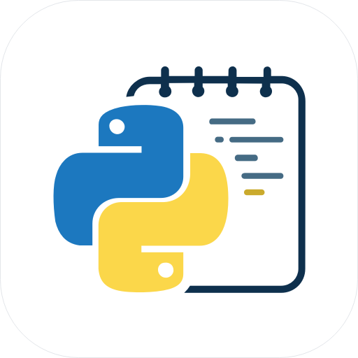
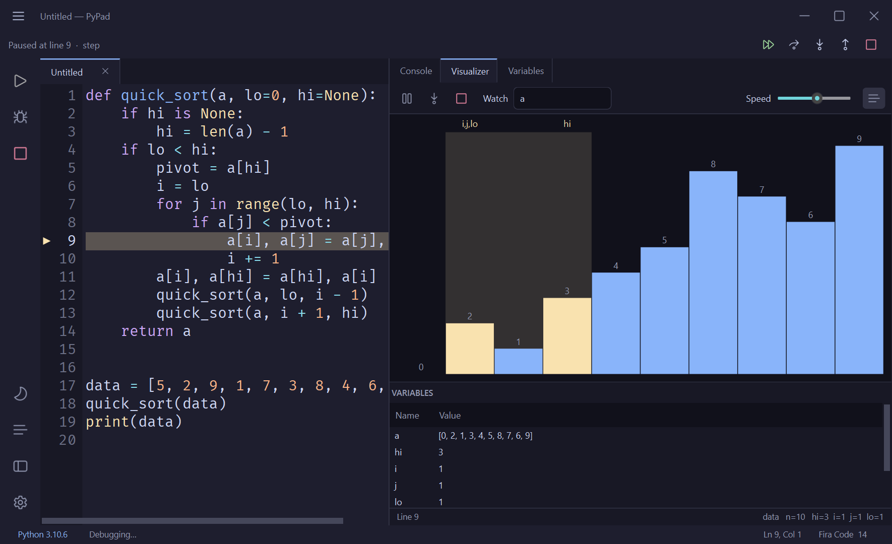

# PyPad

**A fast, beautiful Python scratchpad — write code, run it, debug line‑by‑line, and *watch* your data structures and algorithms come alive.**

&nbsp;

---

## ⬇️ Download

Grab the latest build from the **[Releases page →](https://github.com/vkfolio/PyPad-Releases/releases/latest)**

| Platform | Installer |
|---|---|
| **Windows** | `PyPad-…-Setup.exe` — from the [latest release](https://github.com/vkfolio/PyPad-Releases/releases/latest) |
| **macOS** | [PyPad‑macOS.dmg](https://github.com/vkfolio/PyPad-Releases/releases/latest/download/PyPad-macOS.dmg) (direct download) |

Builds are currently unsigned — on Windows choose *More info → Run anyway* in SmartScreen; on macOS right‑click the app → *Open* the first time.

## 🎬 Demo

<video src="https://github.com/vkfolio/PyPad-Releases/raw/main/assets/demo.mp4" controls width="100%"></video>

▶ [Watch the demo](assets/demo.mp4)

## ✨ Features

- **Frameless, themeable editor** — custom window chrome, light/dark toggle (Catppuccin Mocha / GitHub Light), Fira Code, multi‑tab editing, a folder explorer, and font/size settings.
- **IntelliSense** — completions, signatures and hover, running off the UI thread.
- **Run any code** — pick your Python interpreter; stdout/stderr stream live, and an input line feeds `input()` programs.
- **Line‑by‑line debugger** — breakpoints, step in/over/out, continue, a current‑line marker and a live variables panel.
- **Live DSA Visualizer** 🧠 — the star feature. Your *actual* code drives the animation: press **Play** and watch the real variables evolve, or **Step** through line by line.
  - **93 algorithms across 13 categories**: Sorting, Searching, Two Pointers, Sliding Window, Arrays, Dynamic Programming, Matrix, Grid Pathfinding, Backtracking (Maze, Sudoku, N‑Queens, Knight's Tour), Linked List, Stack/Queue, Trees, and Graphs.
  - **6 renderers**: animated **bars**, **2D grid/matrix**, **binary tree**, **graph**, **linked list**, and **boxes** — with pointer/window highlights, visited cells, and a variables split.
  - Edit the code, change the input, and re‑run — the visualization always reflects *your* code.

## 🚀 Getting started

1. Download and install for your OS (above).
2. Launch PyPad and start typing, or open the **Algorithms** panel (the list icon on the left toolbar) and pick one — its code loads into the editor.
3. Press **▶ Play** in the **Visualizer** tab to animate it, or set a breakpoint and **Debug** to step through.

## 🔒 Privacy & sign-in

PyPad asks you to **sign in with Google** on launch — purely so we can see how many people use PyPad.

- **What's stored:** your Google **name and email**, to create your account (handled by Google / Firebase — PyPad never sees your password).
- **What's *never* collected:** your code, files, keystrokes, editor content, or usage tracking. Everything you write stays on your machine.
- You can **Sign Out** any time from the user menu in the title bar (or Help → Sign Out).

## 💬 Feedback

Found a bug or have an idea? Please open an [issue](https://github.com/vkfolio/PyPad-Releases/issues).

---

© 2026 vkfolio. PyPad is free to download and use 
